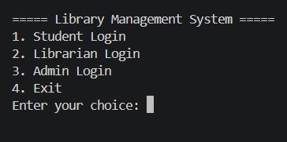
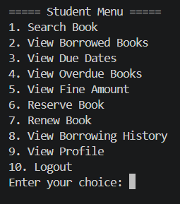
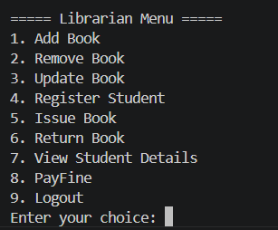
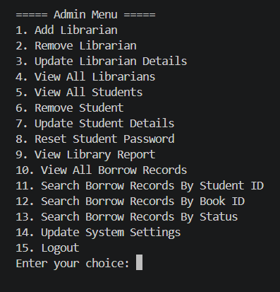
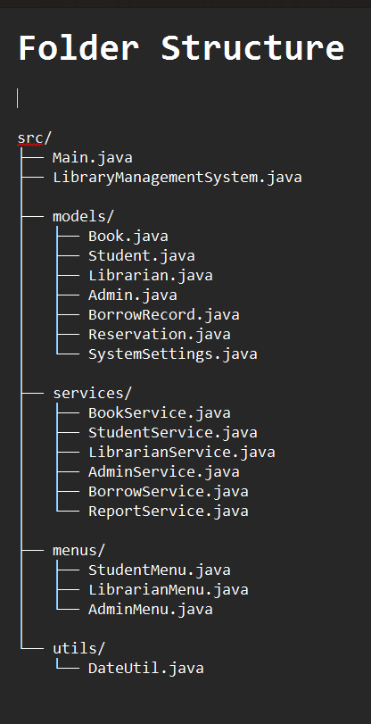

📘 Library Management System (Java)

A console-based Library Management System built using Java.
This project simulates real-world library operations with multiple user roles and complete functionality.

🚀 Features
👨‍🎓 Student
1. Search books
2. View borrowed books
3. View due dates
4. View overdue books
5. View fine amount
6. Reserve books
7. Renew books
8. View borrowing history
9. View profile

👨‍🏫 Librarian
1. Add / Remove / Update books
2. Register students
3. Issue books
4. Return books
5. Collect fine
6. View student details

👨‍💼 Admin
1. Manage librarians
2. Manage students
3. Reset student passwords
4. View reports (books, students, fines, etc.)
5. View all borrow records
6. Update system settings

🧠 Concepts Used
1. Java OOP (Classes, Objects)
2. ArrayList
3. Service-based architecture
4. Package structure
5. Exception Handling
6. Date handling (LocalDate)
7. Real-world logic implementation

    
▶️ How to Run
1. Open terminal inside src folder
Compile:
javac Main.java LibraryManagementSystem.java models/*.java services/*.java menus/*.java utils/*.java
2. Run:
java Main

💡 Future Improvements

1. File handling (data persistence)
2. GUI using Java Swing / JavaFX
3. Database integration (MySQL)
4. Email notifications
5. Web version

## 📸 Screenshots

### Main Menu

### Student Menu

### Librarian Menu

### Admin Menu

### Project Structure

Author 
Prasanna S
